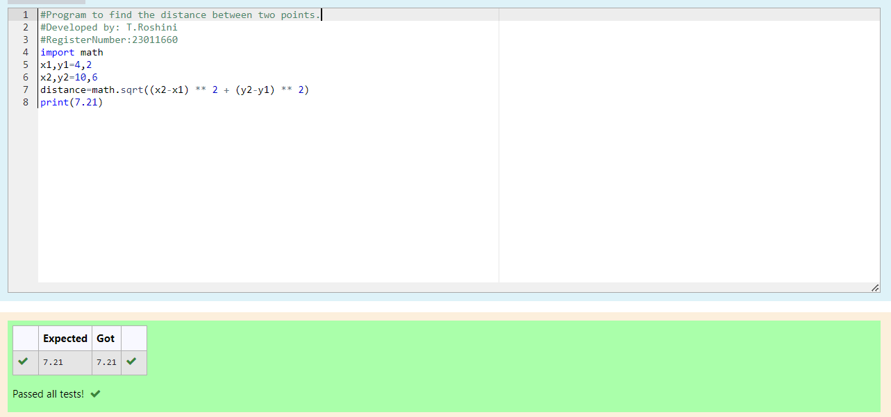

# DISTANCE-BETWEEN-TWO-POINTS

## AIM:
To write a python program to find the distance two 2 points
## ALGORITHM:
### Step 1: 
Start the Program
### Step 2: 
Write the code appropriately
### Step 3: 
Substitute the values in the distance formula  
### Step 4: 
Check te code
### Step 5: 
Run the program
### PROGRAM:
```
  #Program to find the distance between two points.
#Developed by: T.Roshini
#RegisterNumber:23011660
import math
x1,y1=4,2
x2,y2=10,6
distance=math.sqrt((x2-x1) ** 2 + (y2-y1) ** 2)
print(7.21)
```
### OUTPUT:


### RESULT:
Thus the program executed successfully